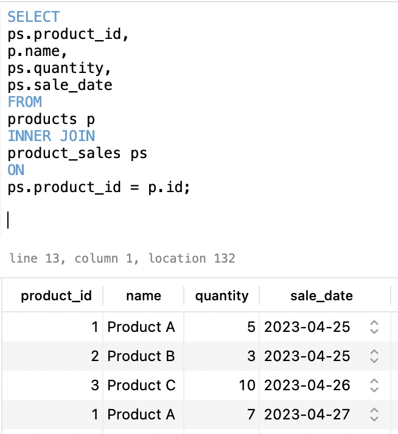
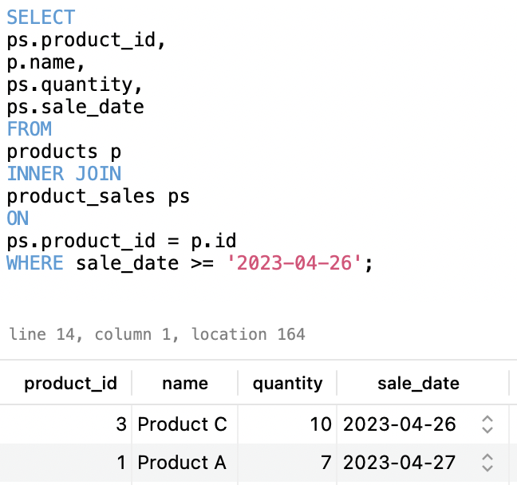
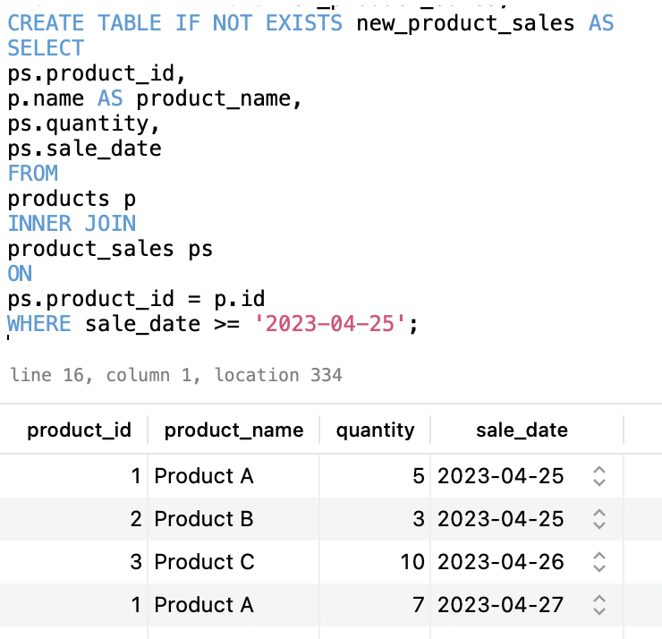
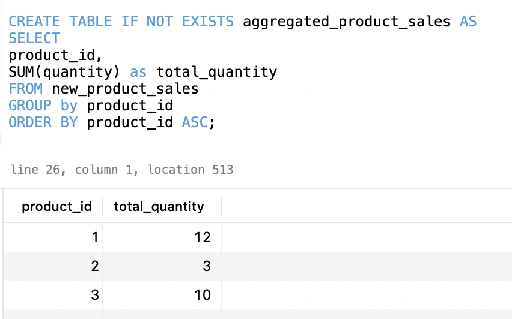
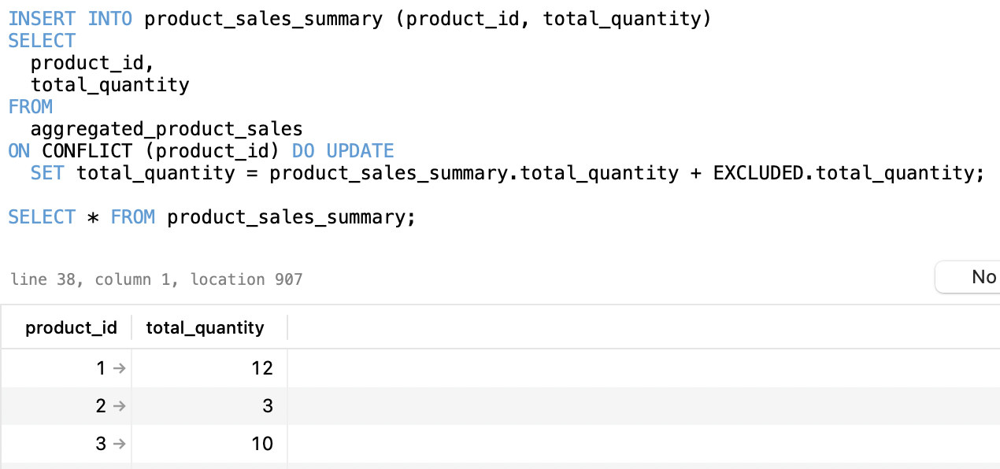

### Task

Your task is to create an Airflow DAG to extract, transform, and load product sales data into a summary table.

**The goal is to calculate the total quantity of each product sold.**

### Expected output

Put together a document where you show your thinking process, explain the nature of the task and your documented solution.

Feel free to use screenshots or any materials you have used!

### Plan

1. Understand the Data
I will use TablePlus to do the following:
    1. **Decipher the data** i.e. what the column names mean, what kind of values and data types.
    2. **Choose which columns would be useful** - i.e. `product_id`, `name`, `quantity` 
    3. **Test queries out step by step** with the following to try out:
        * Loop through rows that's after last execution date on `sale_date` from product_sales and save in temp table *new_product_sales*. 
        * Save `product_id` with its corresponding `SUM(quantity)` to sum up total quantity sold per product from *new_product_sales* and save column as `total_quantity` in temp table *aggregated_product_sales* 
        * When updating *product sales summary*, it should add the `total_quantity` to the corresponding `product_id` if the product_id already exists in the *product_sales_summary* table
        * Bonus: would be good to save the `product_name` in *product_sales_summary* 
    4. **Repeat testing until the query performs as expected**, giving the output I am looking for.

The following is what I expect the output table (sales_rep_summary) to look like:

| product_id | product_name | total_quantity |
|------------|--------------|----------------|
| 1          | Product A    | 2              |
| 2          | Product B    | 3              |
| 3          | Product C    | 5              |

2. Create the DAG script
    1. Import the necessary python libraries and methods
    2. Set the default arguments in a dictionary and create the Dag object with the parameters required
    3. Set the necessary SQL queries for ETL 

3. Run the DAG script
    1. Unpause the dag
    2. Run the dag

### TablePlus process

1. Inner Join products and product_sales

This query looked pretty good and I decided to refine it but adding a WHERE sale_date >= '2023-04-26' to check it can filter after a certain date

2. Inner Join products and product_sales filter sale_date

This looked good and can be used as our first step in the DAG file, with placeholders i.e. previous execution date {{ prev_ds }} and current execution date {{ ds }}.

3. Create the temporary table *new_product_sales* with the query above and use alias on `product_name` column

4. Create the temporary *aggregated_product_sales* to store the total_quantity of each product

Decided to forego the `product_name` column after as when I use the GROUP BY on `product_id` and `product_name` it means it will group base on unique combinations of product_id and product_name

5. Insert values into `product_sales_summary` table

After some research, I found out how to add a CONSTRAINT when updating the *product_sales_summary* if product_id already exists. 

`SET total_quantity = product_sales_summary.total_quantity + EXCLUDED.total_quantity` will add the incoming value `total_quantity` value from aggregated_product_sales to the existing total_quantity in product_sales_summary if that product_id already exists. 

> Now that this looks pretty good, I will use the above sql statement to set up my script for DAG and also drop the two temporary tables *new_product_sales* and *aggregated_product_sales* at the end of the script. 